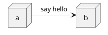

# Typescript

## TS Node

```plantuml
@startuml

node a

node b 

a -> b : say hello
@enduml
```

it like [[java]]

[//begin]: # "Autogenerated link references for markdown compatibility"
[java]: java.md "Java"
[//end]: # "Autogenerated link references"